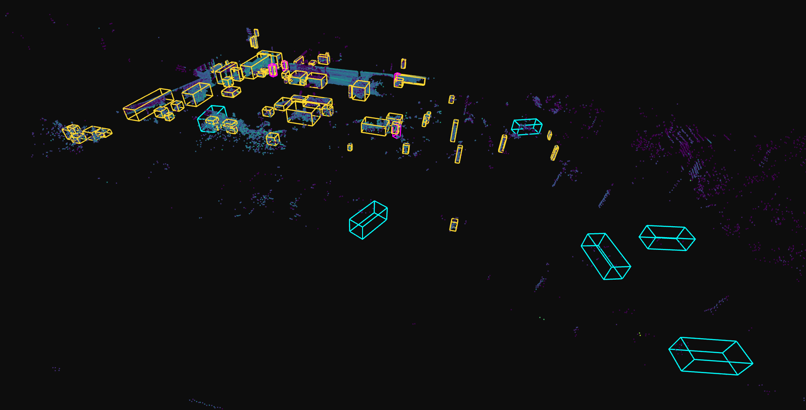
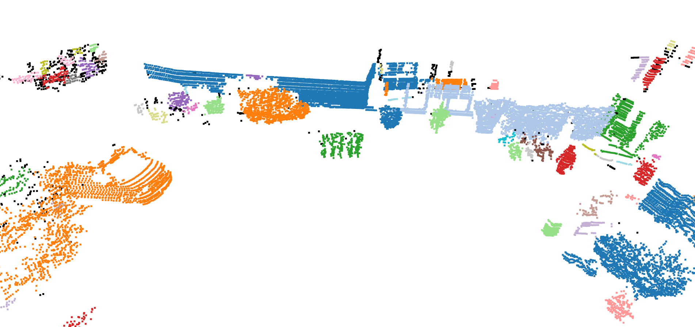
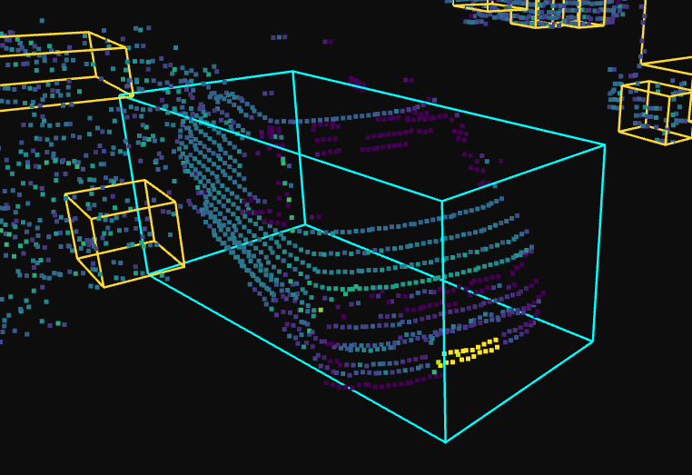
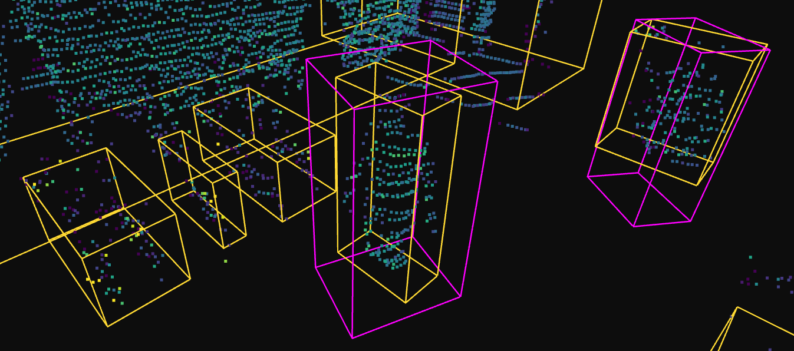
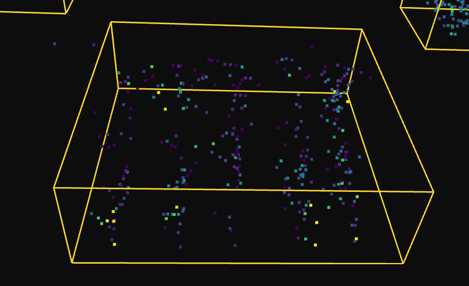
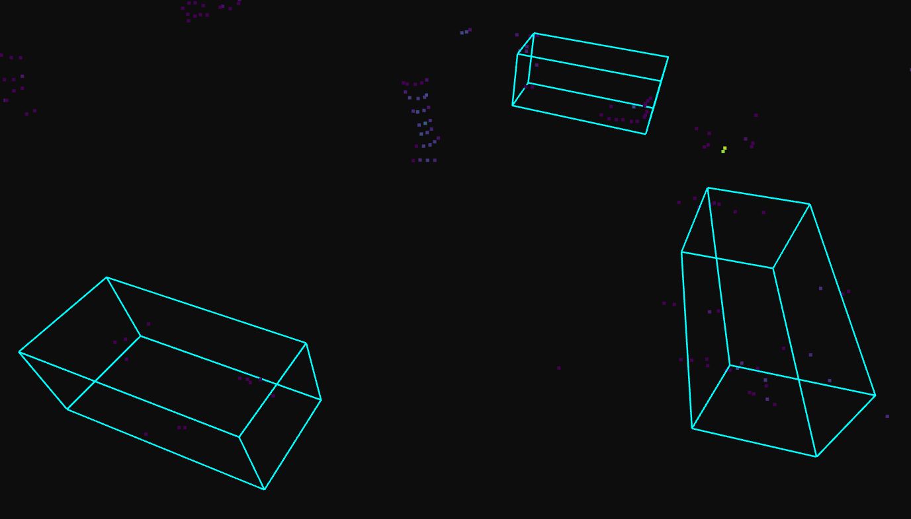

# Lidar Surveillance Demo

## Overview

A lidar surveillance demo on a single KITTI Velodyne frame
(`data/0000000001.bin`, 125 826 points, `(x, y, z, intensity)` float32).
Two complementary detection pipelines run over the frame:

- **Geometric clustering** — every entity in the scene gets a 3D bounding
  box (unclassified, labelled `cluster_N`).
- **Deep learning** — classifiable entities additionally get a class label
  and confidence score via a KITTI-pretrained PointPillars model.

Results combine into one scene overlay via the interactive viewer so each
technique's strengths and limits are surfaced honestly.

## How to run

Tested on Python 3.12.

```
# recommended: run inside a fresh venv
pip install -r requirements.txt
python run.py
python interactive_viewer.py
```

Orbit, zoom, and pan in the viewer; capture screenshots with your OS tool
(Windows `Win+Shift+S`). First-run warm-up: the numba voxelization kernel
JIT-compiles on first inference (a few seconds).

**Windows note:** if `pip install` fails with
`OSError: [Errno 2] No such file or directory` on a long `jupyter` /
`@jupyter-widgets` path (hit via open3d's transitive deps), either extract
this project to a short path like `C:\lidar\` or enable Windows long paths
once from an **admin** PowerShell and run `pip install` from that same
admin session:

```
Set-ItemProperty -Path "HKLM:\SYSTEM\CurrentControlSet\Control\FileSystem" -Name "LongPathsEnabled" -Value 1
```

## Pipeline

```
load (data/0000000001.bin)
   |
   |-> ego removal -> ROI crop (±40m) -> voxel (0.05m) -> SOR
   |     |
   |     +-> RANSAC ground plane + band filter -> objects cloud
   |           |
   |           +-> DBSCAN (eps=0.3, min_pts=10) -> AABB -> geometric filter
   |                 -> outputs/detections_clustering.json          [360°]
   |
   +-> KITTI front ROI -> PointPillars (pass A)
       +-> 180° Z rotation -> PointPillars (pass B) -> rotate back
             -> outputs/detections_dl.json                          [360°]
```

**Frameworks:** Open3D 0.19 (I/O, RANSAC, DBSCAN, AABB, visualisation),
PyTorch 2 CPU (PointPillars inference), numba (JIT voxelization), numpy,
matplotlib. See `requirements.txt`.

**Models:** DBSCAN for unclassified clustering; vendored
[`zhulf0804/PointPillars`](https://github.com/zhulf0804/PointPillars)
pretrained on KITTI (Car / Pedestrian / Cyclist).

## Results on `0000000001.bin`

- Clustering: 68 boxes post geometric-filter
- PointPillars: ~10 detections at `score ≥ 0.3` (top: Pedestrian 0.87 at
  `(+9.13, -5.65, -0.55)`)

Screenshots hand-framed via `interactive_viewer.py` (orbit / zoom, then `Win+Shift+S`).

 <br>
*Isometric overview — clustering boxes (yellow) + DL boxes (class-coloured) over the raw cloud minus ground; the empty cyan cluster on the right previews the hallucination story below.*

 <br>
*Raw DBSCAN output (tab20, noise = black) before the geometric filter. The big orange blob bottom-left is a car over-merged with adjacent structure — filter-dropped, but PointPillars recovers it independently (see car.png). The green vertical stripes in the middle are a row of bicycles, and a small red cluster to the right is a pedestrian — small geometric signatures the filter correctly preserves. The large blue / grey masses along the top edge are wall / facade merges the filter exists to suppress.*

 <br>
*Cyan DL box wraps a car's characteristic ring returns. The bright yellow dots at the bottom are high-intensity reflections off the retroreflective number plate — intensity surfaces fine detail that geometry alone would miss.*

 <br>
*Two magenta Pedestrian boxes stand beside a row of unlabelled `cluster_N` boxes — adjacent bicycles and wall structures caught by geometry but out-of-vocabulary for PointPillars.*

 <br>
*A parked-bike cluster: DBSCAN produces a yellow box, no DL overlay — static bikes fall outside PointPillars' "Cyclist = person-on-moving-bike" class. Out-of-vocab made visible.*

 <br>
*Three confident cyan Car boxes in near-empty regions — PointPillars confabulating on sparse rear-hemisphere returns. Without ground truth there is no automated way to reject these post-inference.*

## Limitations

- **Class vocabulary** — PointPillars knows Car / Pedestrian / Cyclist
  only. Other entities (vegetation, benches, poles, bike racks) are caught
  by clustering as `cluster_N` rather than by the DL detector.
- **Heuristic clustering filter** — the geometric thresholds
  (`max_vol = 50 m³`, `max_ratio = 15`, point-count bounds) are hand-tuned.
  Wall / facade fragments sitting near those boundaries can survive as
  unlabelled `cluster_N`, and genuine entities on the wrong side of the
  cutoff can be dropped.
- **Single frame** — no temporal tracking, no velocity estimation.

## Discussion

- **Lidar vs 2D cameras.** Depth and metric geometry come for free — boxes are in metres with no monocular ambiguity — but returns are sparse at range and carry no colour / texture semantics, so intensity alone is thin for fine-grained classification.
- **Complementary pipelines.** DBSCAN catches out-of-vocabulary entities (parked bikes, facades) the DL detector can't name; PointPillars recovers cars whose points got over-merged into filter-dropped blobs. Neither alone covers the scene.
- **Future work.** Multi-frame temporal tracking + velocity estimation; quantitative evaluation against KITTI ground truth (precision / recall / mAP) to replace heuristic thresholds; a broader-vocab detector (e.g. nuScenes-trained) to shrink the `cluster_N` residue.
- **Scalability.** Single-frame CPU latency is dominated by PointPillars inference; batching frames or moving to GPU is the obvious lever. Clustering and preprocessing are linear in point count and cheap in comparison.

## Layout

```
.
├── preprocess.py           # ego/ROI/voxel/SOR/RANSAC + band filter
├── cluster.py              # DBSCAN + AABB + geometric filter -> JSON
├── detect_dl.py            # two-pass PointPillars inference -> JSON
├── run.py                  # sequential orchestrator
├── io_utils.py             # .bin loader + detection JSON schema
├── interactive_viewer.py   # orbit/zoom viewer for screenshots
├── third_party/PointPillars/   # vendored, CPU-patched
│   └── pretrained/epoch_160.pth
├── data/0000000001.bin
├── outputs/
│   ├── detections_clustering.json
│   └── detections_dl.json
├── screenshots/
├── requirements.txt
└── README.md
```
